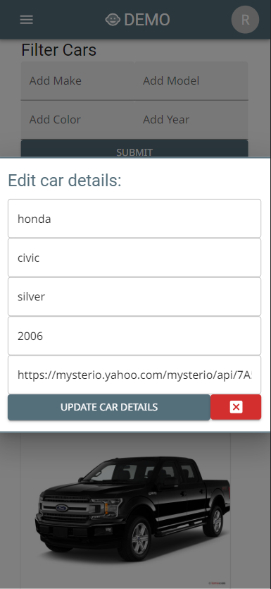

# Demo React Application

This project was bootstrapped with [Create React App](https://github.com/facebook/create-react-app).

## Instructions to Start Application

To connect to PostgreSQL, navigate into the server directory within this project and run: 

### ```nodemon index```

In a new terminal window, navigate into the project directory and run:

### `yarn start`

## Application Screenshots

  
 
